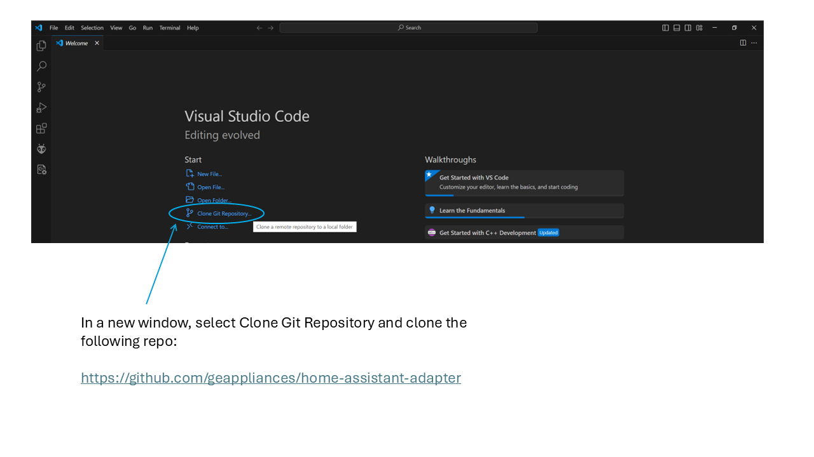
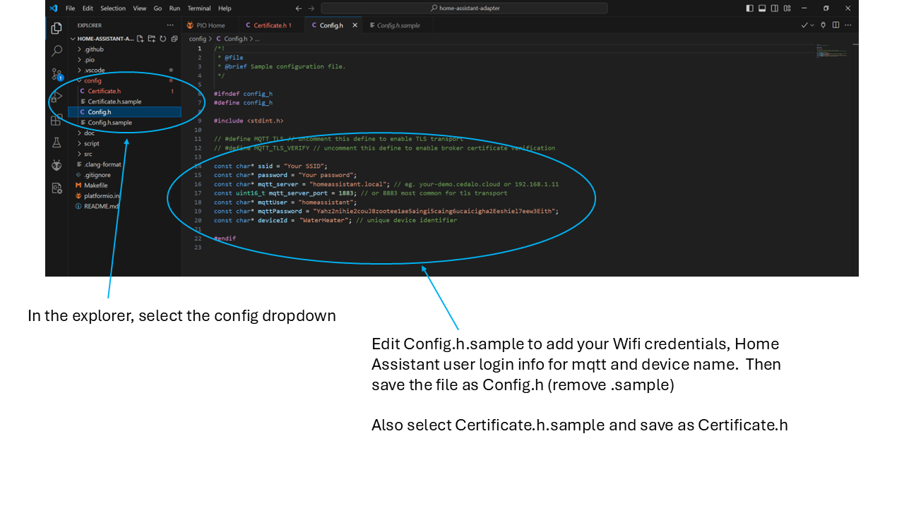
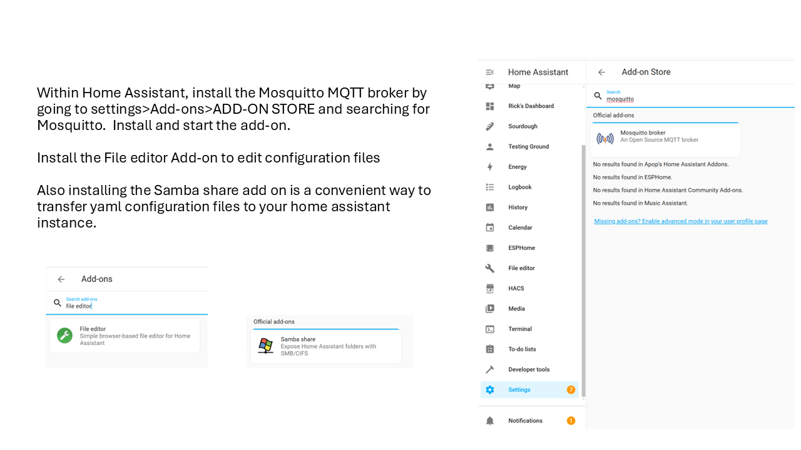
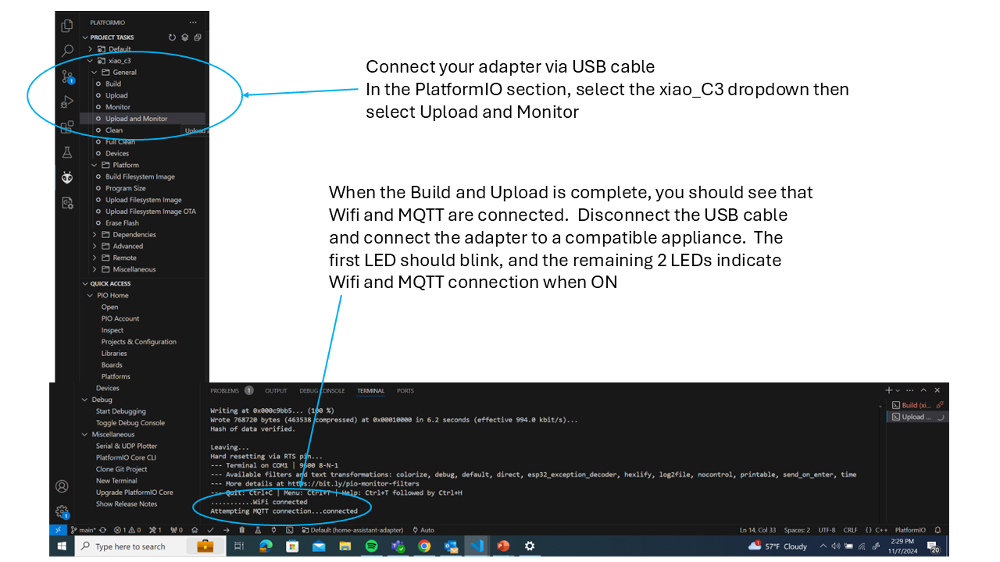
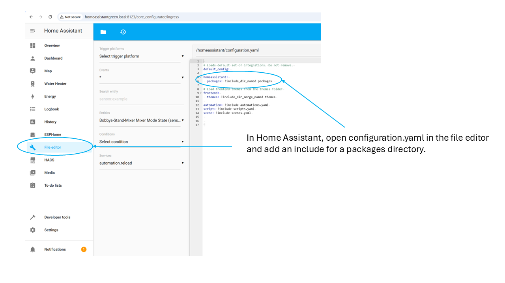
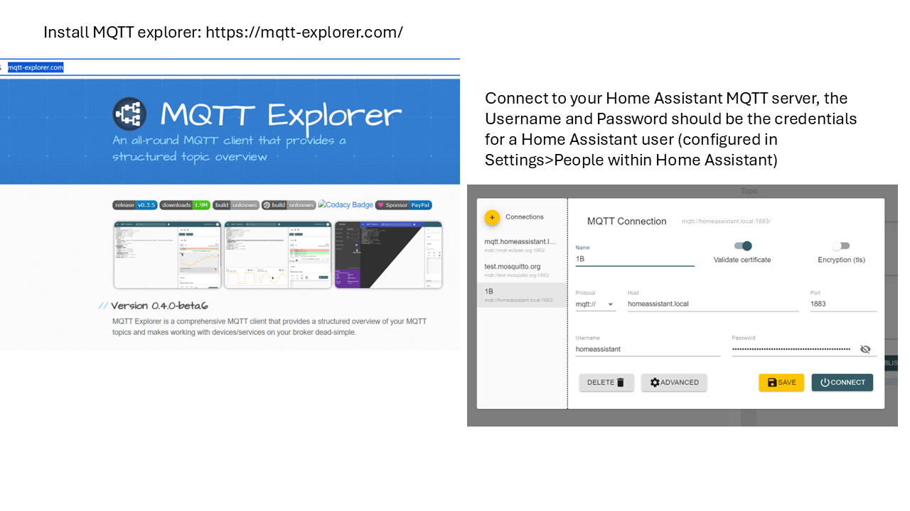
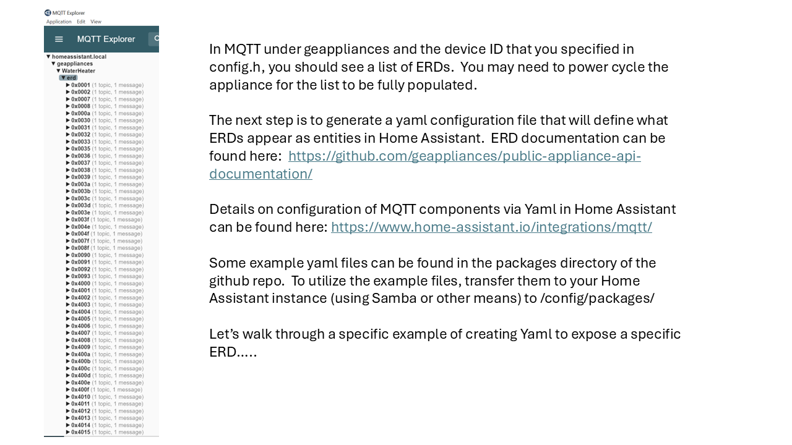

---

### In a new window, select Clone Git Repository and clone the following repo:

https://github.com/geappliances/home-assistant-adapter
---

---

---

---

---
Install MQTT explorer: https://mqtt-explorer.com/

---

In MQTT under geappliances and the device ID that you specified in config.h, you should see a list of ERDs.  You may need to power cycle the appliance for the list to be fully populated.

The next step is to generate a yaml configuration file that will define what ERDs appear as entities in Home Assistant.  ERD documentation can be found here:  https://github.com/geappliances/public-appliance-api-documentation/

Details on configuration of MQTT components via Yaml in Home Assistant can be found here: https://www.home-assistant.io/integrations/mqtt/

Some example yaml files can be found in the packages directory of the github repo.  To utilize the example files, transfer them to your Home Assistant instance (using Samba or other means) to /config/packages/

Let’s walk through a specific example of creating Yaml to expose a specific ERD…..

---
We might as well start at the beginning.  ERD 0x001 is defined as follows in the ERD documentation:

 "name": "Model Number",
    "id": "0x0001",
    "operations": ["read", "publish", "subscribe"],
    "description": "The identifier used to specify what group an appliance belongs to. Unused bytes should be set to 0x00.",
    "updateClass": {
      "type": "legacy"
    },
    "data": [{
      "name": "Model Number",
      "type": "string",
      "offset": 0,
      "size": 32

This ERD reports the model number of the appliance.  We can configure a MQTT sensor in Home Assistant to access this information.  Details can be found here:  https://www.home-assistant.io/integrations/sensor.mqtt/
---
Here is Yaml for this ERD.  The unique_id is a way to identify the sensor.  State_topic lets Home Assistant know where to find the sensor data, this can be found in MQTT explorer, notice the deviceId we specified in config.h is included in the state_topic.  The value_template section converts the hex data of the ERD to a readable string.  The device section defines the MQTT device in Home Assistant under which this sensor will appear.  You can either create a yaml file in the packages directory using the file editor within Home Assistant, or create the file on another device and transfer via Samba.  Once the file is in place you can use Developer Tools>Check Configuration from Home Assistant in order to verify you haven’t generated an error that would prevent Home Assistant from starting, and then  ALL YAML CONFIGURATION from the Yaml reloading section to load the Yaml.  After the restart, under Settings>Devices and Services>MQTT you should see the devices and entities that you created.

# - =========================================
# - MQTT
# - =========================================
mqtt:
  # - =========================================
  # - MQTT Sensors
  # - =========================================
  sensor:
    - name: Model Number
      unique_id: Waterheater_modelnumber
      state_topic: "geappliances/WaterHeater/erd/0x0001/value"
      value_template: >
        
        {%- set chars = " !'#$%&\'()*+,-./0123456789:;<=>?@ABCDEFGHIJKLMNOPQRSTUVWXYZ[\]^_`abcdefghijklmnopqrstuvwxyz{|}~" %}
        
        
        
        
        
        
        
        
        {{ ns.value[0:12] }}
      device:
        name: "WaterHeater"
        identifiers: “Heat Pump Water Heater"
        manufacturer: "GE Appliances"
